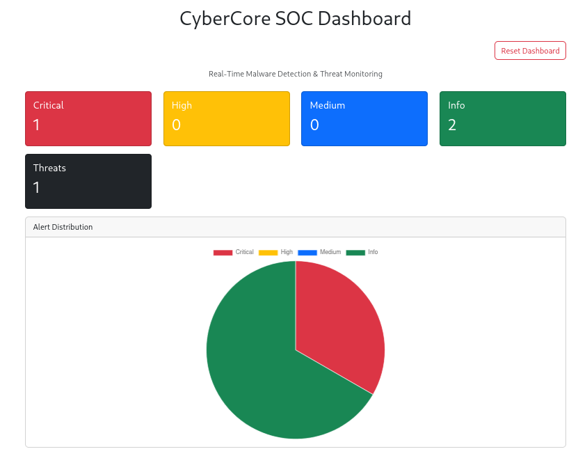
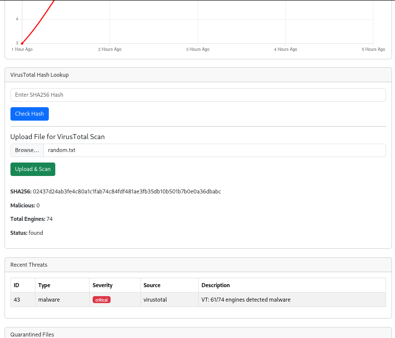
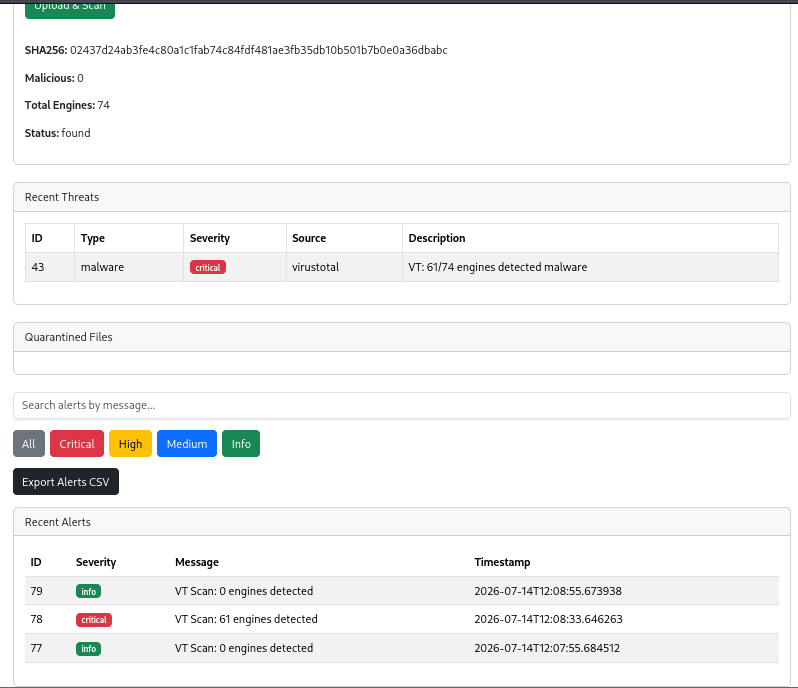
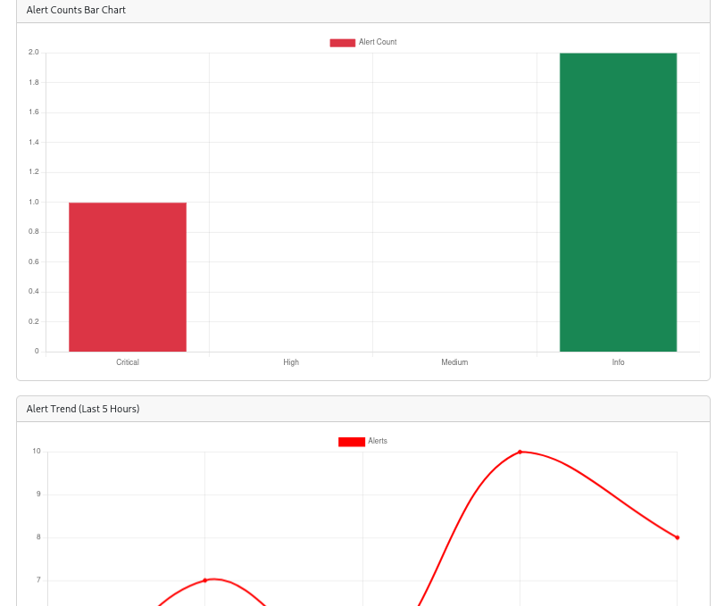

# 🛡️ CyberCore – AI-Powered Cyber Threat Intelligence Platform

CyberCore is a cybersecurity platform designed to provide real-time threat detection, malware analysis, network reconnaissance, and security monitoring through an interactive SOC-style dashboard.

The project combines multiple security tools and threat intelligence services into a single platform for security analysts and cybersecurity learners.

---

# 🚀 Features

### 🔍 Network Scanning

* Nmap integration
* Port scanning
* Service detection
* Scan history tracking

### 🦠 Malware Detection

* YARA rule-based malware scanning
* File upload scanning
* Custom YARA rules support

### 🌐 Threat Intelligence

* VirusTotal Hash Lookup
* VirusTotal File Analysis
* Threat reputation checks
* Detection statistics and severity mapping

### 🚨 Security Monitoring

* Real-time file monitoring
* Ransomware activity detection
* Alert generation and tracking

### 📊 SOC Dashboard

* Threat Overview Dashboard
* Alert Statistics
* Alert Trend Analysis
* Alert Distribution Charts
* Threat Monitoring Interface

---

# 🧰 Technology Stack

| Layer               | Technology             |
| ------------------- | ---------------------- |
| Frontend            | React, Vite            |
| Backend             | Flask                  |
| Database            | PostgreSQL, SQLAlchemy |
| Security Tools      | Nmap, YARA             |
| Threat Intelligence | VirusTotal API         |
| Monitoring          | Watchdog               |
| Development OS      | Kali Linux             |

---

# 📸 Screenshots

## Dashboard

---

## VirusTotal Lookup

---

## Alert Dashboard

---

## Alert Analytics

---

# 📂 Project Structure

CyberCore/

├── backend/

│ ├── models/

│ ├── routes/

│ ├── services/

│ ├── monitoring/

│ └── yara_rules/

│

├── frontend/

│ ├── src/

│ ├── public/

│ └── components/

│

├── screenshots/

└── README.md

---

# ⚙️ Installation

## Clone Repository

git clone https://github.com/BhargavaKrishna97/CyberCore.git

cd CyberCore

---

## Backend Setup

cd backend

python3 -m venv venv

source venv/bin/activate

pip install -r requirements.txt

python app.py

---

## Frontend Setup

cd frontend

npm install

npm run dev

---

# 🔑 Environment Variables

Create a .env file inside backend directory.

DATABASE_URL=your_database_url

JWT_SECRET_KEY=your_secret_key

VIRUSTOTAL_API_KEY=your_api_key

---

# 🌐 Core Modules

### Nmap Scanner

* Port Discovery
* Service Enumeration
* Scan History

### YARA Scanner

* Rule Based Detection
* File Upload Scanning

### VirusTotal Integration

* Hash Lookup
* File Analysis
* Detection Statistics

### Monitoring Engine

* Real-Time File Monitoring
* Alert Generation
* Threat Logging

---

# 📈 Current Status

✅ React Dashboard

✅ Flask Backend

✅ PostgreSQL Integration

✅ VirusTotal Integration

✅ Nmap Scanner

✅ YARA Scanner

✅ Alert Analytics

✅ Threat Monitoring

✅ Real-Time File Monitoring

🚧 Authentication Improvements

🚧 Deployment

---

# 👥 Contributors

### Bhargava Krishna

* Flask Backend Development
* Database Integration
* Security APIs
* Core Backend Architecture

### Naga Revathi Thalakaturi

* React Dashboard Development
* VirusTotal Integration
* Threat Dashboard
* Alert Management
* Alert Severity Classification
* Security Analytics Charts
* API Integration
* UI Development
* Testing and Validation
* Documentation

---

# 🎯 Future Enhancements

* JWT Authentication
* Email Alerting
* SIEM Integration
* Threat Hunting Module
* MITRE ATT&CK Mapping
* AI-Based Threat Correlation

---

CyberCore demonstrates practical SOC operations, malware analysis workflows, threat intelligence integration, and security monitoring within a unified platform.

